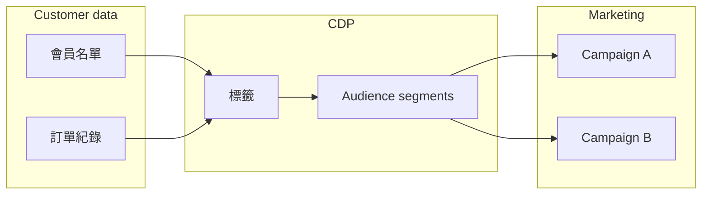
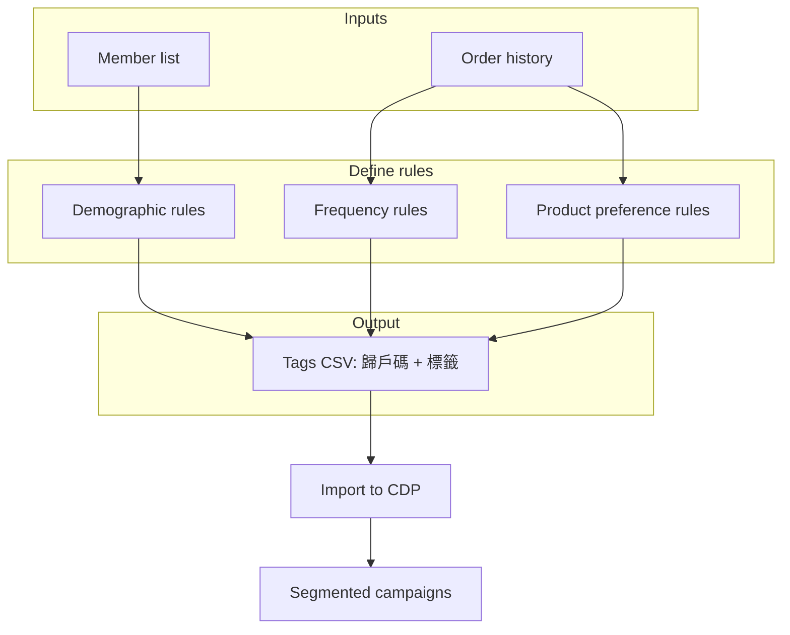

# Product Requirements Document (PRD)

## Stockfeel CDP — Segmented Marketing Platform

| Field | Value |
|-------|-------|
| **Product** | Stockfeel CDP (Customer Data Platform) + CSV Cleaner |
| **Version** | 1.0 |
| **Last updated** | 2026-05-22 |
| **Related docs** | [PDR — technical design](docs/PDR.md) · [README — CSV tool usage](README.md) |

---

## 1. Product vision

Stockfeel CDP exists to power **segmented marketing**: treat different customers differently so each group receives messages and offers that fit their behavior—and are more likely to **spend more** on the client’s products.



**Core belief:** A fan who only buys tickets should not get the same push as a fan who buys jerseys every season. Segmentation turns generic blasts into relevant outreach—and relevant outreach converts better.

---

## 2. Business goal: segmented marketing

| Goal | Description |
|------|-------------|
| **Relevance** | Show the right product, channel, and message to the right person |
| **Revenue** | Increase repeat purchase, basket size, and category cross-sell |
| **Efficiency** | Reduce wasted sends to people who will never buy that category |
| **Retention** | Re-engage lapsed buyers before they churn |

### What “success” looks like

- Marketing can name an audience in plain language (“high-frequency ticket buyers under 30”) and reach them in the CDP.
- Campaigns tied to tags/segments show higher click-through and conversion than untargeted sends.
- Ops can refresh segments when new order and member data is imported—without rebuilding spreadsheets from scratch.

---

## 3. Who we serve

| Role | Need |
|------|------|
| **Client marketing team** (e.g. volleyball club) | Run campaigns for tickets, merchandise, memberships |
| **Stockfeel / agency ops** | Import clean data, define tags, hand off audiences to send tools |
| **Account managers** | Explain to clients how purchase + member data becomes segments |

### Example client: professional volleyball team

The club sells:

- **Tickets** — match-day, season, VIP  
- **Apparel** — jerseys, t-shirts, scarves  
- **Other** — accessories, F&B bundles, fan experiences  

Each product line has different buyers. CDP helps label fans by **what they buy**, **how often**, and **who they are**—then market each line to the fans most likely to care.

---

## 4. Data foundation (three sheets)

The CDP is built on three imports (see `csv_example/`):

| Sheet | File example | Purpose |
|-------|----------------|---------|
| **會員名單** (member list) | `example_member_list.csv` | Who the customer is |
| **訂單紀錄** (orders) | `example_orders.csv` | What they bought, when, how much |
| **標籤** (tags) | `example_tags.csv` | Labels attached to each member for segmentation |

All sheets link members through **`歸戶碼`** (household / member ID).

### Member list — attributes for “who”

Typical fields:

- `歸戶碼`, `手機`, `Email`, `會員名稱`
- `性別`, `加入時間`, `生日`, `LINE UID`

**Used for tags like:** age band, gender, tenure (“member since 2021”), channel (has LINE UID).

### Purchase records — attributes for “what” and “how much”

Typical fields:

- Order: `訂單編號`, `訂單時間`, `訂單狀態`, `總計`
- Member link: `歸戶碼`
- Product: `商品編號`, `商品名稱`, `商品類別`, `數量`, `小計`

**Used for tags like:** purchase frequency, category preference, spend tier, last purchase recency.

### Tags — the segment labels

Format (`example_tags.csv`):

```csv
歸戶碼,標籤
123456,"標籤一,標籤二,標籤三"
```

- One row per member (`歸戶碼`).
- **`標籤`** can hold **multiple tags in one cell**, comma-separated.
- Tags are **assigned to people**, not to individual orders.

---

## 5. How tags are created (conceptual workflow)

Tags are not magic inside the CDP—they are **business rules applied to member + order data**. Someone (ops, analyst, or a future automated job) **derives** tags, then uploads or updates the tags sheet.



### Step-by-step (manual process today)

1. **Import** clean member list and order files into the CDP (this website helps map messy CSVs to the correct columns).
2. **Analyze** orders per `歸戶碼` (in Excel, SQL, or a future in-product rules engine).
3. **Apply rules** → produce a list of `歸戶碼` + tag name(s).
4. **Export** a tags CSV matching `example_tags.csv`.
5. **Import tags** into the CDP alongside members and orders.
6. **Build campaigns** in the marketing tool: “send X to everyone with tag `high_frequency_ticket`.”

---

## 6. Tag types and example rules

Below are **recommended tag families** for sports / retail clients. Exact thresholds should be agreed per client (e.g. “high frequency” = 3+ orders in 12 months).

### 6.1 Purchase frequency

| Tag example | Rule (illustrative) | Marketing use |
|-------------|---------------------|---------------|
| `freq_high` | ≥ 4 paid orders in last 12 months | Loyalty perks, early access |
| `freq_mid` | 2–3 orders in last 12 months | Nudge to second purchase |
| `freq_low` | 1 order in last 12 months | Win-back, first-repeat offer |
| `freq_none_12m` | No paid order in 12 months | Re-activation campaign |

**Data source:** `訂單紀錄` — count distinct `訂單編號` per `歸戶碼`, filter `訂單狀態` = success (or client-defined).

### 6.2 Product category preference

| Tag example | Rule (illustrative) | Marketing use |
|-------------|---------------------|---------------|
| `pref_ticket` | ≥ 60% of line items or revenue in `商品類別` = 票券 / tickets | Match promos, season packages |
| `pref_apparel` | Majority spend on 服飾 / merchandise | New jersey drops, bundle deals |
| `pref_mixed` | Material spend in 2+ categories | Cross-sell (“complete your fan kit”) |
| `buyer_ticket_only` | Only ticket SKUs, never apparel | Introduce merch with ticket bundle |

**Data source:** `訂單紀錄` — `商品類別`, `商品名稱`, `小計` grouped by `歸戶碼`.

### 6.3 Monetary value (spend tier)

| Tag example | Rule (illustrative) | Marketing use |
|-------------|---------------------|---------------|
| `spend_vip` | Lifetime or rolling 12m `總計` sum in top 10% | VIP events, premium seating |
| `spend_core` | Mid spend band | Standard promotions |
| `spend_entry` | Low spend but active | Upsell to higher SKU |

**Data source:** `訂單紀錄` — sum `總計` or `小計` per `歸戶碼`.

### 6.4 Recency (RFM — Recency)

| Tag example | Rule (illustrative) | Marketing use |
|-------------|---------------------|---------------|
| `recent_30d` | Last `訂單時間` within 30 days | Thank-you, review ask |
| `lapsed_90d` | Last order 90–180 days ago | “We miss you” + coupon |
| `churn_risk_180d` | No order in 180+ days | Aggressive win-back |

**Data source:** `訂單紀錄` — max `訂單時間` per `歸戶碼`.

### 6.5 Demographics (from member list)

| Tag example | Rule (illustrative) | Marketing use |
|-------------|---------------------|---------------|
| `age_18_24` | `生日` → age bracket 18–24 | Student discounts |
| `age_25_34` | Age 25–34 | Core fan campaigns |
| `age_35_plus` | Age 35+ | Family pack, premium seating |
| `gender_female` / `gender_male` | `性別` field | Creative / offer tailoring (where appropriate) |
| `member_new` | `加入時間` within last 90 days | Onboarding series |
| `member_veteran` | Member 2+ years | Loyalty recognition |

**Data source:** `會員名單` — `生日`, `性別`, `加入時間`.

### 6.6 Channel / identity

| Tag example | Rule (illustrative) | Marketing use |
|-------------|---------------------|---------------|
| `has_line` | `LINE UID` not empty | LINE push |
| `email_only` | Email present, no LINE | Email journey |

**Data source:** `會員名單`.

---

## 7. Worked example: volleyball team fan

**Member:** `歸戶碼` = `FAN-1001`  
**Orders (simplified):**

| 訂單時間 | 商品類別 | 小計 |
|----------|----------|------|
| 2025-09-01 | 票券 | 1,200 |
| 2025-10-15 | 票券 | 800 |
| 2025-11-20 | 服飾 | 1,500 |
| 2026-01-10 | 票券 | 600 |

**Derived tags (example):**

```text
freq_high
pref_ticket
pref_mixed
recent_30d
spend_core
```

**Comma-separated row for CDP import:**

```csv
歸戶碼,標籤
FAN-1001,"freq_high,pref_ticket,pref_mixed,recent_30d,spend_core"
```

**Campaign ideas:**

| Segment | Message angle |
|---------|----------------|
| `freq_high` + `pref_ticket` | Season ticket renewal before public sale |
| `pref_mixed` + `recent_30d` | “Add a jersey to your next match day” bundle |
| `freq_none_12m` + past `pref_ticket` | Win-back: single-game ticket offer |

---

## 8. Combining tags for segments

Tags are **building blocks**. Marketing audiences are usually **AND / OR** combinations:

| Audience name | Tag logic | Intent |
|---------------|-----------|--------|
| Hot ticket buyers | `pref_ticket` AND `freq_high` | Maximize season pass conversion |
| Merch upsell pool | `pref_ticket` AND NOT `pref_apparel` | Cross-sell apparel |
| Young high spenders | `age_18_24` AND `spend_vip` | Exclusive drop, limited merch |
| Sleepy VIPs | `spend_vip` AND `lapsed_90d` | Personal outreach before churn |

The CDP (or connected campaign tool) filters members by tags; this PRD defines **what tags to create**, not the campaign UI.

---

## 9. Product scope: this website

### 9.1 Shipped today — CSV Cleaner

Web app: [https://untitledhotdag.github.io/sf_group_cdp_cleaner/](https://untitledhotdag.github.io/sf_group_cdp_cleaner/)

| Capability | Description |
|------------|-------------|
| Map columns | Align vendor CSVs to CDP `example_*.csv` schemas |
| Validate | Catch bad emails, dates, numbers before import |
| Export | Download cleaned `會員名單`, `訂單紀錄`, `標籤` files |

**Role in segmentation:** Reliable data **into** the CDP. Tags themselves are still defined and computed outside the tool (spreadsheet, SQL, or future features).

### 9.2 “How tagging works” in-app page (shipped)

| Requirement | Priority | Status |
|-------------|----------|--------|
| **P1** | High | **Done** — `/guide/tags` on the live site; linked from home |
| **P2** | Medium | Downloadable tag rule templates (CSV or checklist) |
| **P3** | Low | In-browser tag **preview**: upload member + order CSVs, apply simple rules, export `example_tags.csv` format |

The guide page does not require login; same browser-only privacy model as the CSV tool.

---

## 10. Principles for good tags

| Principle | Guidance |
|-----------|----------|
| **Actionable** | Every tag should map to a campaign or treatment—not “nice to know” only |
| **Stable names** | Use snake_case or consistent English/Chinese labels; avoid renaming monthly |
| **Documented rules** | Write the SQL/Excel logic next to the tag name so ops can reproduce |
| **Refresh cadence** | Recalculate after each order import (weekly/monthly per client) |
| **Avoid overlap confusion** | Prefer `freq_high` + `freq_mid` as mutually exclusive buckets |
| **Privacy** | Age/gender tags: use only where compliant; aggregate into brackets |

---

## 11. Non-goals (CDP + this product)

| Item | Notes |
|------|-------|
| Send email/LINE from this website | Campaign execution stays in marketing tools |
| Real-time scoring | Batch tags from periodic imports is v1 |
| Single merged mega-CSV | CDP uses three files; cleaner keeps them separate |
| Auto-tag without rules | Future P3; v1 is educational + manual export |

---

## 12. Success metrics

| Metric | Target direction |
|--------|------------------|
| Time to prepare import files | Decrease vs manual spreadsheet work |
| Import error rate | Near zero after using CSV Cleaner |
| % campaigns using tagged segments | Increase vs blast-all |
| Revenue per segmented campaign | Higher than untargeted baseline (client-reported) |
| Tag catalog coverage | Core RFM + category + demo tags for each client |

---

## 13. Open questions

| # | Question | Owner |
|---|----------|-------|
| 1 | Official tag naming convention (EN vs 中文)? | Client + Stockfeel |
| 2 | Should comma-separated tags in one cell be split into multiple rows by CDP on import? | CDP product |
| 3 | Minimum order history window for frequency tags (6m vs 12m)? | Per client |
| 4 | Who owns rule definition—Stockfeel ops or client marketing? | Account |

---

## 14. Revision history

| Version | Date | Changes |
|---------|------|---------|
| 1.0 | 2026-05-22 | Initial PRD: segmented marketing goal, tag derivation from member + orders, volleyball example, planned in-app guide |

---

## 15. References

- CDP example files: `csv_example/example_member_list.csv`, `example_orders.csv`, `example_tags.csv`
- Technical implementation: [docs/PDR.md](docs/PDR.md)
- Live CSV tool: [sf_group_cdp_cleaner](https://untitledhotdag.github.io/sf_group_cdp_cleaner/)
