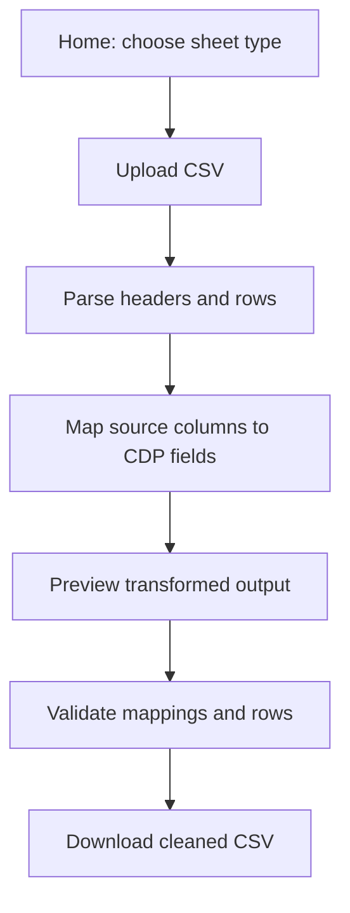

# Product Design Record (PDR)

## Stockfeel CDP CSV Cleaner

| Field | Value |
|-------|-------|
| **Product name** | Stockfeel CDP CSV Cleaner |
| **Version** | 1.1.0 |
| **Status** | Shipped (v1 + real CDP schema) |
| **Last updated** | 2026-05-22 |
| **Owner** | Stockfeel |
| **Repository** | `stockfeel_cdp` |

---

## 1. Executive summary

Stockfeel CDP CSV Cleaner is a **browser-only web application** that helps operations and marketing teams prepare customer data for import into the Stockfeel CDP SaaS. Raw CSV files from vendors, CRMs, and e-commerce platforms often use different column names and formats than the CDP expects. This product provides a guided GUI to **map source columns to the CDP target schema**, **preview transformed data**, **validate rows**, and **download cleaned CSV files**—without sending any data to a server.

---

## 2. Problem statement

### Context

The Stockfeel CDP ingests three types of data:

1. **User list** — customer profiles
2. **Purchase records** — transactions linked to users
3. **Tags** — user-to-tag pairs used for audience segmentation and marketing

Together, purchase history and tags enable pinning specific user groups for campaigns.

### Pain points

| Pain | Impact |
|------|--------|
| Source CSVs use inconsistent schemas | Manual spreadsheet work, import failures |
| Column names differ by vendor | Error-prone copy/paste and scripting |
| Type and format mismatches | Rejected imports (dates, emails, amounts) |
| No single tool for all three sheet types | Fragmented workflows |

### Opportunity

A lightweight, privacy-preserving column-mapping tool reduces time-to-import and errors before data reaches the CDP.

---

## 3. Goals and non-goals

### Goals (v1)

| ID | Goal |
|----|------|
| G1 | Support three separate import flows: member list, orders, tags |
| G2 | Let users map arbitrary source columns to a configurable CDP field schema |
| G3 | Preview mapped output before export |
| G4 | Validate required mappings and row-level types; block export by default when invalid |
| G5 | Run entirely in the browser (no backend, no data upload) |
| G6 | Schema aligned with official CDP examples in `csv_example/` |

### Non-goals (v1)

| ID | Excluded |
|----|----------|
| NG1 | Excel (`.xlsx`) multi-tab upload |
| NG2 | Backend API, authentication, multi-tenant accounts |
| NG3 | Merging three sheets into one workbook |
| NG4 | AI-assisted column guessing |
| NG5 | Scheduled/batch processing |
| NG6 | Direct upload to the CDP SaaS API |

---

## 4. Users and use cases

### Primary users

- **Operations / data ops** — clean vendor exports before CDP import
- **Marketing** — prepare tag and purchase files for segmentation

### Use cases

| # | Actor | Scenario |
|---|-------|----------|
| UC1 | Ops | Upload a CRM user export with non-standard headers; map to CDP user fields; download cleaned CSV |
| UC2 | Marketing | Upload purchase history from Shopify; map `cust_id` → `user_id`; validate amounts and dates |
| UC3 | Marketing | Upload tag assignments; ensure every row has `user_id` and `tag` |
| UC4 | Ops | Re-import from the same vendor weekly; saved mapping preset auto-fills column links |

---

## 5. Product flow



### Step detail

| Step | User action | System behavior |
|------|-------------|-----------------|
| 1. Home | Select 會員名單, 訂單紀錄, or 標籤 | Navigate to sheet-specific wizard |
| 2. Upload | Drop or choose `.csv` | Parse file; strip BOM; detect issues (empty file, no headers) |
| 3. Map | Assign source column per CDP field | Auto-match on header similarity; persist preset in `localStorage` |
| 4. Preview | Review mapped table | Show CDP column order; first N rows |
| 5. Validate | Fix errors or export anyway | Row-level errors with row number and field |
| 6. Export | Download | Filename: `{sheetId}_clean_{YYYY-MM-DD}.csv` |

---

## 6. Data model

### Sheet types

The CDP accepts **three independent CSV files**. Each has its own target schema defined in `src/schemas/`.

#### 6.1 Member list (`member_list`)

**Reference:** `csv_example/example_member_list.csv` · **Schema version:** `1.0.0`

| Column (CDP header) | Required | Type | Notes |
|---------------------|----------|------|-------|
| 歸戶碼 | Yes | string | Unique member / household ID |
| 手機 | Yes | string | |
| Email | Yes | email | |
| 會員名稱 | No | string | |
| 性別 | No | string | |
| 加入時間 | No | date | Output `YYYY/MM/DD` |
| 生日 | No | date | Output `YYYY/MM/DD` |
| LINE UID | No | string | |

#### 6.2 Orders (`orders`)

**Reference:** `csv_example/example_orders.csv` · **Schema version:** `1.0.0`

| Column (CDP header) | Required | Type |
|---------------------|----------|------|
| 訂單編號 | Yes | string |
| 訂單時間 | Yes | date (`YYYY/MM/DD`) |
| 訂單狀態 | No | string |
| 總計 | Yes | number |
| 歸戶碼 | Yes | string |
| 手機 | No | string |
| Email | No | email |
| 會員名稱 | No | string |
| 商品編號 | Yes | string |
| 商品名稱 | No | string |
| 商品規格 | No | string |
| 數量 | Yes | number |
| 商品原價 | No | number |
| 商品售價 | No | number |
| 小計 | No | number |
| 出貨地址 | No | string |
| 商品類別 | No | string |

#### 6.3 Tags (`tags`)

**Reference:** `csv_example/example_tags.csv` · **Schema version:** `1.0.0`

| Column (CDP header) | Required | Type | Notes |
|---------------------|----------|------|-------|
| 歸戶碼 | Yes | string | Links to member list |
| 標籤 | Yes | string | Multiple tags may be comma-separated in one cell |

### Schema configuration shape

```ts
type SheetId = 'member_list' | 'orders' | 'tags'

type CdpField = {
  key: string          // Exact CDP CSV header (Chinese)
  label: string
  required: boolean
  type: 'string' | 'email' | 'number' | 'date' | 'boolean'
  aliases?: string[]   // Vendor header names for auto-match
  dateFormat?: 'slash' // CDP dates use YYYY/MM/DD
}

type SheetSchema = {
  id: SheetId
  title: string
  exampleFile: string
  version: string
  fields: CdpField[]
}
```

### In-memory session model


- Session state lives in React component state until **Start over** clears it.
- No PII is transmitted over the network.

---

## 7. Functional requirements

### FR-1 Upload

- Accept `.csv` only
- Support drag-and-drop and file picker
- Reject empty files and files without a header row with a clear error message
- Warn when duplicate column names are detected
- Load up to **500 rows** into memory for preview/validation (large files are truncated for processing in v1)

### FR-2 Column mapping

- One control per CDP field (dropdown of source columns + “— none —”)
- Required fields listed first and visually highlighted
- **Auto-match:** pre-select source column when header matches CDP field `key` or `label` (case-insensitive, normalized)
- **Presets:** save mapping to `localStorage` keyed by sheet type + sorted header hash

### FR-3 Transforms (on map / export)

| Type | Transform |
|------|-----------|
| string | Trim whitespace |
| email | Lowercase, trim; validate format |
| number | Parse number (strip commas) |
| date | Accept common input formats; CDP output `YYYY/MM/DD` |
| boolean | Accept true/false, yes/no, 1/0 |

### FR-4 Validation

- Block mapping export if any **required** CDP field has no source column
- Per-row validation with `{ rowIndex, field, message }` (row index = spreadsheet row, header = row 1)
- Export button disabled when invalid (**strict mode**)
- **Export anyway** bypasses validation for edge cases

### FR-5 Export

- Output CSV with CDP field keys as headers and fields in schema order
- Download filename: `{sheetId}_clean_{ISO-date}.csv`

---

## 8. Routes and information architecture

| Route | Screen |
|-------|--------|
| `/` | Home — three sheet type cards |
| `/import/member_list` | 會員名單 import wizard |
| `/import/orders` | 訂單紀錄 import wizard |
| `/import/tags` | 標籤 import wizard |
| `/import/users`, `/import/purchases` | Redirects to new routes |

---

## 9. Technical architecture

### Stack

| Layer | Technology |
|-------|------------|
| UI | React 19 + TypeScript |
| Build | Vite |
| Styling | Tailwind CSS v4 |
| Routing | React Router |
| CSV | Papa Parse |
| Validation | Zod |

### Module layout

```
src/
  schemas/          # CDP target definitions (config-driven)
  lib/
    csv/            # parseCsvFile, exportCsv, download
    mapping/        # applyMapping, autoMatch, transforms
    validation/     # validateRows
    presets/        # localStorage presets
  components/       # FileDropzone, ColumnMapper, previews, etc.
  pages/            # Home, ImportWizard
```

### Privacy and security

- All CSV parsing and export occur **client-side**
- No analytics or upload endpoints in v1
- `localStorage` may contain column mapping presets (no row data)

---

## 10. UX requirements

| Requirement | Implementation |
|-------------|----------------|
| Progress clarity | Step indicator: Upload → Map → Preview → Export |
| Required fields obvious | Badge + indigo highlight in mapper |
| Friendly errors | Parse, mapping, and row errors in plain language |
| Duplicate column warning | Banner when duplicate headers detected |
| Repeat vendor imports | Auto-match + localStorage preset |

---

## 11. Success criteria (v1)

| # | Criterion | Status |
|---|-----------|--------|
| S1 | User can clean a misaligned CSV for each of the three sheet types | Met |
| S2 | Mapped preview matches CDP column order | Met |
| S3 | Validation catches type errors before export | Met |
| S4 | No customer data leaves the browser | Met |
| S5 | CDP schema updatable without UI rewrite | Met (config in `src/schemas/`) |

---

## 12. Test assets

Sample files in `fixtures/`:

| File | Purpose |
|------|---------|
| `users_source.csv` | Misaligned headers; invalid email on row 4 |
| `purchases_source.csv` | Invalid amount on row 4 |
| `tags_source.csv` | Empty tag on row 5 |

See [README.md](../README.md) for the manual test checklist.

---

## 13. Open items and dependencies

| Item | Status | Action |
|------|--------|--------|
| Official Stockfeel CDP field spec | **Done** | Sourced from `csv_example/example_*.csv` |
| CDP import API integration | Out of scope v1 | Future: optional direct upload |
| Excel support | Out of scope v1 | Future v2 |
| Full-file processing (>500 rows) | Partial | v1 truncates to 500 rows in memory; extend if needed |
| Tag row expansion | Not implemented | CDP allows comma-separated tags in one cell per example |

### Schema update procedure

1. Update `csv_example/` reference files and `src/schemas/*.ts`
2. Adjust `src/lib/validation/validate.ts` if needed
3. Bump `version` on each `SheetSchema`
4. Update this PDR and README

---

## 14. Future roadmap (v2+)

- Excel (`.xlsx`) upload with sheet selection
- Process full files beyond 500-row limit (streaming)
- Combined workflow across all three sheet types
- Direct CDP API upload with credentials
- AI-suggested column mappings
- Shared mapping presets across team (requires backend)

---

## 15. Revision history

| Version | Date | Author | Changes |
|---------|------|--------|---------|
| 1.0.0 | 2026-05-22 | — | Initial PDR documenting v1 implementation |
| 1.1.0 | 2026-05-22 | — | Real CDP schema from `csv_example/`; routes `member_list`, `orders`, `tags` |

---

## 16. References

- [README.md](../README.md) — setup, usage, schema update guide
- [Implementation plan](../.cursor/plans/cdp_csv_cleaner_73ca27a4.plan.md) — original v1 plan (if present in workspace)
- CDP examples: `csv_example/example_member_list.csv`, `example_orders.csv`, `example_tags.csv`
- Schema source: `src/schemas/member_list.ts`, `orders.ts`, `tags.ts`
